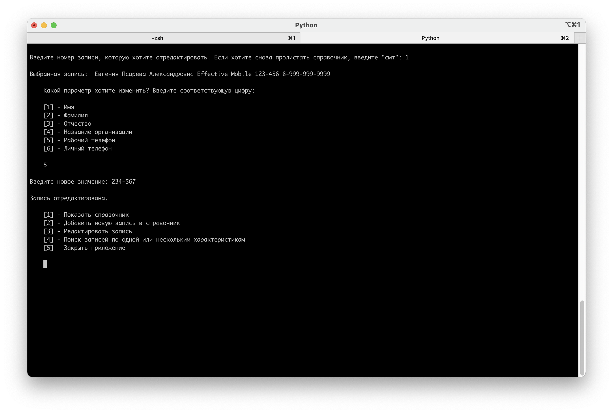

# Phonebook
### Консольное приложение для просмотра, редактирования, добавления новых записей и поиска по телефонному справочнику.
  
Используемые технологии: `Python 3`  
Автор: Евгения Псарева 
Контакты: epsareva77@gmail.com  
***

## Функционал программы
- Скопируйте на свой компьютер файлы проекта. Октройте папку проекта в терминале.
- Чтобы запустить приложение, выполните команду `python3 src/phonebook.py`
- Установите рекомендуемый размер окна терминала, чтобы на нем помещались записи справочника: 160х40

- В главном меню приложения можно выбрать, какое действие выполнить:

- В режиме просмотра справочника можно листать страницы или вернуться в гланое меню:

- В режиме добавления новой записи пользователю будет предложено ввести необходимые данные. После чего запись добавится в справочник, а пользователь снова окажется в главном меню:

- В режиме редактирования записи пользователю предлагается выбрать номер записи, которую он хочет отредактировать. Затем он выбирает параметр, который хочет отредактировать. После этого вводит новое значение выбранного параметра. В результате запись в справочнике редактируется, а пользователь оказывается в главном меню:

- В режиме поиска пользователю предлагается ввести один или несколько параметров, по которым будет производится поиск. После получения параметров приложение запрашивает их значения:

- Когда значния получены, приложение показывает найденные записи в режиме просмотра справочника:

